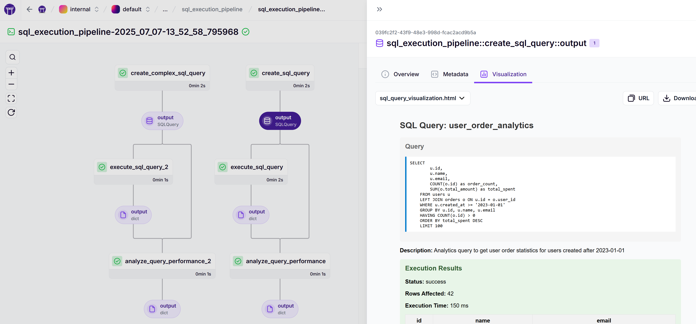

# ZenML SQL Pipeline Examples

This repository demonstrates how to create ZenML pipelines for executing SQL scripts in sequence, with both simple and advanced approaches.

## 🎯 Use Cases

- Execute multiple SQL scripts in a specific order
- Track SQL execution results and performance
- Secure database credential management
- Advanced SQL query visualization and metadata extraction

## 📋 Quick Start

### Prerequisites
```bash
pip install -r requirements.txt
zenml init
```

### Option 1: Simple SQL Pipeline (Recommended for beginners)

**Run the basic example:**
```bash
python simple_sql_pipeline.py
```

This demonstrates:
- Sequential SQL script execution
- Error handling and validation
- Basic result tracking
- ZenML secrets integration (optional)

### Option 2: Advanced SQL Pipeline with Custom Materializer

**Run the advanced example:**
```bash
python sql_pipeline.py
```

This demonstrates:
- Custom materializer for rich visualizations
- Advanced metadata extraction
- Query performance analysis
- Dashboard integration

## 🚀 Simple Approach

Perfect for straightforward SQL script execution:

```python
from zenml import step, pipeline
from zenml.client import Client

@step
def execute_sql_script(script_name: str, query: str) -> dict:
    """Execute a SQL script and return results."""
    
    # Get database credentials from ZenML secrets
    client = Client()
    try:
        db_secret = client.get_secret("db_credentials")
        # Use credentials to connect to database
    except:
        # Fallback to mock execution
        pass
    
    # Execute SQL and return results
    return {"status": "success", "rows_affected": 100}

@pipeline
def simple_sql_pipeline():
    """Execute multiple SQL scripts in sequence."""
    
    # Define your SQL scripts
    scripts = [
        {"name": "create_tables", "query": "CREATE TABLE users (...)"},
        {"name": "insert_data", "query": "INSERT INTO users (...)"},
        {"name": "update_records", "query": "UPDATE users SET ..."},
    ]
    
    # Execute in sequence
    for script in scripts:
        result = execute_sql_script(script["name"], script["query"])
    
    return results
```

## 🎨 Advanced Approach

For rich visualizations and metadata tracking:

```python
from zenml import step, pipeline
from sql_materializer import SQLQueryMaterializer
from sql_executor import SQLQuery

@step(output_materializers=SQLQueryMaterializer)
def create_sql_query() -> SQLQuery:
    """Create a SQL query with metadata."""
    
    return SQLQuery(
        query="SELECT * FROM users WHERE created_at > '2023-01-01'",
        name="user_analytics",
        description="Get recent users"
    )

@step
def execute_query(query: SQLQuery) -> dict:
    """Execute the SQL query."""
    return query.execute()

@pipeline
def advanced_sql_pipeline():
    """Pipeline with custom materializer for rich visualizations."""
    
    query = create_sql_query()
    result = execute_query(query)
    
    return result
```

## 🔐 Setting Up Database Credentials

### Basic Setup
```bash
zenml secret create db_credentials \
    --host=your-db-host \
    --username=your-username \
    --password=your-password \
    --database=your-database
```

### BigQuery Setup
```bash
zenml secret create bigquery_credentials \
    --project_id=your-project-id \
    --client_email=your-service-account@project.iam.gserviceaccount.com \
    --private_key=@path/to/private-key.json
```

Or run the setup script:
```bash
python setup_secrets.py
```

## 📁 Repository Structure

```
├── simple_sql_pipeline.py      # Basic SQL pipeline example
├── sql_pipeline.py            # Advanced pipeline with custom materializer
├── sql_executor.py            # SQLQuery class with execution logic
├── sql_materializer.py        # Custom materializer for visualizations
├── setup_secrets.py           # Helper to set up credentials
├── requirements.txt           # Python dependencies
└── README.md                  # This file
```

## 🎯 Simple Pipeline Features

- **Sequential Execution**: Scripts run in order with dependency tracking
- **Error Handling**: Pipeline stops if any script fails
- **Result Validation**: Validates execution results
- **Mock Execution**: Works without database connection for testing
- **Secrets Integration**: Secure credential management

## 🎨 Advanced Pipeline Features

- **Custom Materializer**: Rich visualizations in ZenML dashboard
- **Metadata Extraction**: Query complexity, keywords, performance metrics
- **HTML Visualizations**: Interactive query results display
- **Performance Analysis**: Query optimization recommendations
- **Artifact Tracking**: Full query lineage and versioning

### ZenML Dashboard Visualization

The advanced pipeline with custom materializer provides rich visualizations in the ZenML dashboard:



This shows:
- **Pipeline DAG**: Visual representation of SQL query execution flow
- **SQL Query Visualization**: Interactive display of your SQL queries with syntax highlighting
- **Execution Results**: Status, execution time, and rows affected
- **Query Metadata**: Descriptions, parameters, and performance metrics
- **Result Preview**: Sample data from query execution

## 📊 Example SQL Scripts

The simple pipeline includes examples for:
- Table creation
- Data insertion
- Record updates
- Data querying
- Cleanup operations

## 🛠️ Customization

### Adding Your Own SQL Scripts

Edit the `scripts` list in `simple_sql_pipeline.py`:

```python
scripts = [
    {
        "name": "your_script_name",
        "query": "YOUR SQL QUERY HERE"
    },
    # Add more scripts...
]
```

### Connecting to Real Databases

Replace the mock execution in `execute_sql_script()` with your database connection logic:

```python
# Example for PostgreSQL
import psycopg2

def execute_sql_script(script_name: str, query: str) -> dict:
    client = Client()
    db_secret = client.get_secret("db_credentials")
    
    conn = psycopg2.connect(
        host=db_secret.secret_values["host"],
        username=db_secret.secret_values["username"],
        password=db_secret.secret_values["password"],
        database=db_secret.secret_values["database"]
    )
    
    cursor = conn.cursor()
    cursor.execute(query)
    
    # Return actual results
    return {"status": "success", "rows_affected": cursor.rowcount}
```

## 🚀 Getting Started

1. **Clone this repository**
2. **Install dependencies**: `pip install -r requirements.txt`
3. **Initialize ZenML**: `zenml init`
4. **Set up credentials** (optional): `python setup_secrets.py`
5. **Run simple example**: `python simple_sql_pipeline.py`
6. **Run advanced example**: `python sql_pipeline.py`

## 📈 Next Steps

- Adapt the SQL scripts for your use case
- Set up real database connections
- Add error handling and retry logic
- Implement data validation steps
- Explore ZenML dashboard visualizations

## 🤝 Support

This example provides a solid foundation for SQL pipeline execution in ZenML. Modify the scripts and connection logic to match your specific requirements!